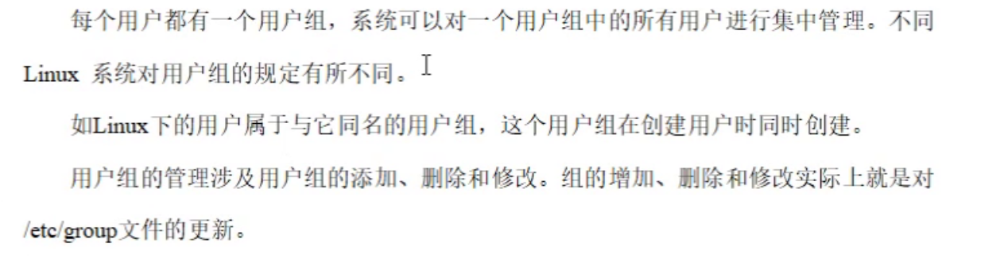

# shell编程学习笔记

### linux默认使用的shell

/bin/bash

### linux下不同颜色的文件对应的类型

```
绿色文件： 可执行文件，可执行的程序  

红色文件：压缩文件或者包文件

蓝色文件：目录

白色文件：一般性文件，如文本文件，配置文件，源码文件等 

浅蓝色文件：链接文件，主要是使用ln命令建立的文件

红色闪烁：表示链接的文件有问题

黄色：表示设备文件

灰色：表示其他文件
```

### 修改文件的执行权限

```
chmod +x 将普通文件（灰色）+x之后变为绿色

chmod -x 将可执行文件（绿色）变为普通文件（灰色）
```

## 11.8

### 用户管理类命令

```
useradd 添加用户
passwd 设置密码
id 查看用户是否存在
cat /etc/passwd 查看已创建的用户
su 切换用户
userdel 删除用户
userdel -r 用户名 （用户及用户主目录全部删除）

who 查看登录用户信息
sudo 设置普通用户拥有root权限
需要修改 /etc/sudoers

usermod 修改用户
```

### 用户组管理命令

每个用户有一个用户组，系统可以对一个用户组中的所有用户进行集中管理。不同linux系统对用户组的规定有所不同。



总结：

每一个用户都属于某一个用户组，在创建新用户时可以通过 -g 来指定新用户所属的用户组，如果不指定则默认在创建新用户的时候创建以该用户为名的一个用户组。

```
groupadd
groupdel
groupmod -n newname oldname
usermod -g 组名 用户名
```

### mount/umount 挂载/卸载的概念

用磁盘---挂载；（将Linux中的目录与磁盘对应的文件系统建立联系， 即将某磁盘对应的文件系统挂在到要使用的目录中）

不用磁盘--卸载；


### netstat 显示网络统计信息和端口占用情况

```
netstat -anp | grep 进程号 （查看当前进程网络信息）
netstat -nlp | grep 端口号 （查看网络端口号占用情况）
```

**todo：**

复习并笔记以下内容：

1.ln软链接相关命令和原理；---ok

2.删除软链接  cd -P-------ok

3.总结文件权限的三组信息；----ok

4.find和 locate的区别； ---ok

5.ps -ef | grep "" 父进程和子进程如何查看？---ok

6.crontab  linux创建定时任务如何创建？ 有什么弊端？ ---ok

7.YUM和RPM下载的共同点和区别？---ok

8.chown 修改用户/用户组 （没看明白。。。）----------okokokk

# 11.9

### ln命令

```
ln 原文件名 链接文件名 --->创建硬链接（共享相同数据块以及原文件的副本）
ln -s 原文件/目录名 --->创建软链接 （相当于windows中的快捷方式，可以方便的访问不在同一目录下的文件）
关于删除：
1.删除硬链接：删除原文件后仍然可以访问硬链接中的文件，只有二者全部删除后才会释放磁盘空间；
2.删除软链接：删除原文件后，软链接目录也会失效，成为“断链”。
```

**关于逻辑目录和物理目录**

cd -L：访问逻辑目录 代表当前目录路径（默认）

cd -P：访问物理目录 代表软链接目录对应的原目录路径

cd -P link-dir ---->结果会跳转到原目录中

### **linux文件权限：**


1：文件权限

```
在ll命令的输出结果中，第一列是文件类型和权限，其中文件类型用一个字母表示，如下：
d：目录
-：普通文件
b：块设备文件
c：字符设备文件
l：符号链接文件
s：套接字文件
p：命名管道文件

文件权限信息，一共由10个字符组成，可以分为三组，每组由3个字符组成：
第一组表示文件类型：d表示目录，-表示普通文件，l表示符号链接文件。
第二组表示文件所有者的权限：r表示读，w表示写，x表示执行，-表示没有对应的权限。
第三组表示文件所属组的权限：r表示读，w表示写，x表示执行，-表示没有对应的权限。
第四组表示其他人的权限：r表示读，w表示写，x表示执行，-表示没有对应的权限。
```

2：文件所属用户

3：文件所属用户组

4：文件大小（单位为字节）

### 文件权限与数字的关系

```
r：read 代表读取权限 用数字4表示
w：write 代表写入权限 用数字2表示
x：excute 代表执行权限 用数字1表示
读取、写入、运行三项权限可以用数字表示，就是r=4,w=2,x=1。所以，rwxr-xr-x用数字表示成755。

常用的Linux文件权限
444 r--r--r--
600 rw-------
644 rw-r--r--
666 rw-rw-rw-
700 rwx------
744 rwxr--r--
755 rwxr-xr-x
777 rwxrwxrwx
```

### find和locate的区别


**locate命令查找不到存在的文件原因**
由于mlocate.db数据库每天系统自动更新一次，因此，我们在用whereis和locate 查找文件时，有时会找到已经被删除的数据，或者明明是刚刚创建的文件，却找不到，原因就是因为数据库文件没有及时被更新。

**解决方法**
因此为了真实反应文件的存在性，可以在使用locate之前，先使用updatedb命令，手动更新数据库。

```
updatedb
```

### 进程相关

| 选项 |            说明            |
| :--: | :------------------------: |
|  -a  | 显示当前中断的所有进程信息 |
|  -u  |  以用户的格式显示进程信息  |
|  -x  |   显示后台进程运行的参数   |
|  -e  |        显示所有进程        |
|  -f  |           全格式           |

**查看进程信息**


返回信息：


**查看父进程信息**


返回信息


总结：

ps aux 查看进程信息

ps ef 查看进程信息并可以看到每个进程对应的父进程编号。

### crontab

**crontab命令** 被用来提交和管理用户的需要周期性执行的任务，与windows下的计划任务类似，当安装完成操作系统后，默认会安装此服务工具，并且会自动启动crond进程，crond进程每分钟会定期检查是否有要执行的任务，如果有要执行的任务，则自动执行该任务。 

https://blog.csdn.net/u011837804/article/details/130556084

（目前感觉不会太用到，先了解一下概念吧）

### YUM和RPM

**1.rpm :**RedHat package manage的简写

rpm 是linux的一种软件包名称，以.rmp结尾，安装的时候语法为：rpm -ivh，rpm包的安装有一个很大的缺点就是文件的关联性太大，有时候装一个软件要安装很多其他的软件包，很麻烦。

rpm用于互联网下载包的打包及安装工具，它包含在某些Linux分发版本中。它生成具有.RPM扩展名的文件。RPM是RedHat Package Manager（RedHat软件包管理工具）的缩写，类似windows的setup.exe，这一文件格式名称虽然法伤了RedHat的标志，但理念是通用的。 

**2.yum（全称为 Yellow dog Updater, Modified）**

yum是一个在Fedora和RedHat以及SUSE中的Shell前端软件包管理器。基於RPM包管理，能够从指定的服务器自动下载RPM包并且安装，可以自动处理依赖性关系，并且一次安装所有依赖的软体包，无须繁琐地一次次下载、安装。yum提供了查找、安装、删除某一个、一组甚至全部软件包的命令，而且命令简洁而又好记。
为了解决rpm安装时文件关联行太大的问题,RedHat小红帽开发了yum安装方法，他可以彻底解决这个关联性的问题，很方便，只要配置两个文件即可安装，安装方法是：yum -y install ，yum并不是一中包，而是安装包的软件
yum的命令形式一般是如下：yum [options] [command] [package ...]
其中的[options]是可选的，选项包括-h（帮助），-y（当安装过程提示选择全部为"yes"），-q（不显示安装的过程）等等。[command]为所要进行的操作，[package ...]是操作的对象。

**3.区别**
rpm 只能安装已经下载到本地机器上的rpm 包. 

yum能在线下载并安装rpm包,能更新系统,且还能自动处理包与包之间的依赖问题,这个是rpm 工具所不具备的。
但是如果你已经下载了rpm包，那么建议采用rpm命令安装：rpm -ih ****.rpm 即可
参考https://blog.51cto.com/imlearner/2112413

### chown

**1.更改文件的所有者**

要更改文件的所有者，可以使用以下命令：

sudo chown newowner filename
其中，newowner是你想要设置的新所有者的用户名，filename是要更改所有者的文件名。

示例：

假设有一个文件example.txt，当前所有者为user1，我们想将其所有者更改为user2，可以执行以下命令：

sudo chown user2 example.txt

**2.递归地更改目录及其内容的所有者**

如果你需要递归地更改目录及其内容的所有者，可以使用-R参数：

sudo chown -R newowner directory
这会将目录directory及其所有内容的所有者都设置为newowner。

示例：

假设有一个目录myfolder，其中包含了一些文件和子目录，当前所有者为user1，我们想将其所有者以及所有内容的所有者更改为user2，可以执行以下命令：

sudo chown -R user2 myfolder
很好，我们继续接下来的内容。

**3.使用--from参数改变所有者**

你可以使用--from参数来指定当前所有者的名称，并将其更改为新的所有者：

sudo chown --from=oldowner newowner filename
这将把文件filename的所有者从oldowner更改为newowner。

示例：

假设我们有一个文件data.txt，其当前所有者为userA，我们希望将所有者从userA更改为userB，可以使用以下命令：

sudo chown --from=userA userB data.txt

**4.使用--reference参数参考其他文件或目录的所有者**

有时候，你可能希望将一个文件或目录的所有者设置为另一个文件或目录的所有者。这时可以使用--reference参数：

sudo chown --reference=referencefile targetfile
这将把targetfile的所有者设置为referencefile的所有者。

示例：

假设我们有两个文件source.txt和target.txt，其中source.txt的所有者是userX，我们希望将target.txt的所有者设置为与source.txt相同，可以执行以下命令：

sudo chown --reference=source.txt target.txt

## 11.14

### 总结shell的功能

是一个命令行解释器，调用用户的指令，调用linux内核以操作硬件。

### ./a.sh 和 bash a.sh的区别

直接运行没有执行权限，需要通过chmod来添加执行权限才可以运行，而bash a.sh是使用bash解释器来执行，不需要拥有执行权限。

### 关于bin目录

不管是不是root用户，系统在某用户下都会预留一个bin目录（提前加到环境变量里，用户可以自己创建这个目录），可以将脚本/程序命令 放到bin目录里来直接运行。

## 11.20

### 流程控制

- **基本语法**

```
单分支：
if [条件判断] 
then

    程序

fi

多分支：
if [条件判断]
then

   程序
   
elif [条件判断]
then

   程序
else
   程序

fi
```


## 11.28

### cut命令

```
cut [option] filename
说明：默认分隔符是制表符
选项参数：
-b(bytes): 指定文件按照字节数来分割；
-d： 指定文件的分隔符；
-f： 指定输出文件分割后的列数；
-c： 按字符进行切割 后加加n 表示取第几列  比如 -c 1
```

### awk命令

```
awk  [选项参数] ‘/pattern1/{action1}  /pattern2/{action2}...’ filename
pattern：表示awk在数据中查找的内容，就是匹配模式
action：在找到匹配内容时所执行的一系列命令
ps：
也可以不执行匹配模式直接执行action

选项参数：
-F: 指定输入文件的分隔符，以空格为默认分隔符；
-v：赋值一个用户定义变量
```

eg：

```
统计文件第三列值为CDS的数量
awk '$3=="CDS" {count++} END{print count}' fv-gff-3.bed

交换文件的列
awk '{temp=$3; $3=$4; $4=temp; print}' tmp.txt > msnew-exon-1.bed

输出文件的第一列和第七列，并按逗号分割：
awk -F : 'BEGIN{print "user, shell"} {print $1","$7} END{print "dahaige,/bin/zuishuai"}' passwd
注意：BEGIN 在所有数据读取行之前执行；END 在所有数据执行之后执行。

awk '{$5=="Simple_repeat"; print}' ab-rptAndsv.txt > svRpt-SR.txt
```

- **内置变量**

```
FILENAME	文件名
NR	已读的记录数（行号）
NF	浏览记录的域的个数（切割后，列的个数）

eg：
awk -F : '{print "filename:" FILENAME  ",linenum:" NR ",col:"NF}' passwd 
```

