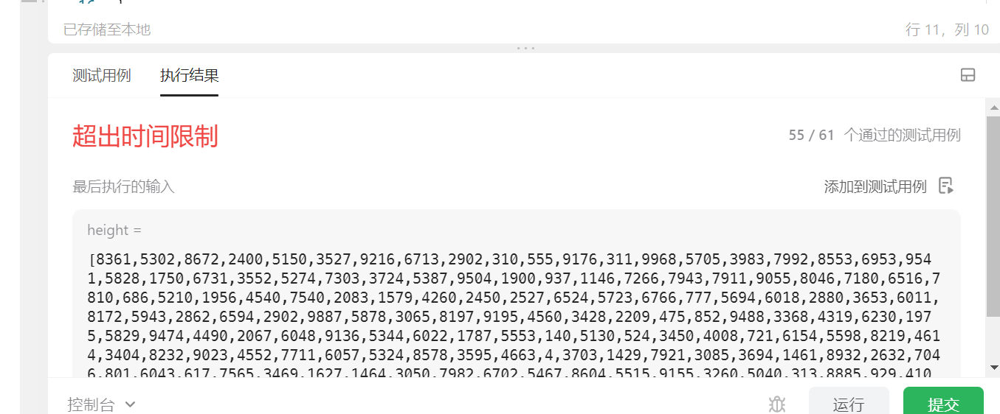

# 算法笔记

## 9.6

### 异或运算的性质

```
异或运算有以下三个性质：
任何数和0做异或运算，结果仍然是原来的数，即a⊕0=a。
任何数和其自身做异或运算，结果是0，即a⊕a=0。
异或运算满足交换律和结合律，即 a⊕b⊕a=b⊕a⊕a=b⊕(a⊕a)=b⊕0=b。
```

ps：可以延伸到的题：lcNo136题


## 23/7/5

### No88题 合并两个有序数组

```
输入：nums1 = [1,2,3,0,0,0], m = 3, nums2 = [2,5,6], n = 3
输出：[1,2,2,3,5,6]
解释：需要合并 [1,2,3] 和 [2,5,6] 。
合并结果是 [1,2,2,3,5,6] ，其中斜体加粗标注的为 nums1 中的元素。
```

**思路：**

两个有序数组n1和n2，那么两个数组中最大的数一定是n1[m-1]或者n2[n-1],此时还需要定位到n1[n1.len-1],所以每次循环需要比较n1[m-1]和n2[n-1]，二者哪个大就放到数组最后一位。假设i=n1.len-1，那么其实就是每次循环比较m和n位置处对应数组的大小，并和n1的i处进行交换。

- No27 原地移除元素

```
输入：nums = [3,2,2,3], val = 3
输出：2, nums = [2,2]
解释：函数应该返回新的长度 2, 并且 nums 中的前两个元素均为 2。你不需要考虑数组中超出新长度后面的元素。例如，函数返回的新长度为 2 ，而 nums = [2,2,3,3] 或 nums = [2,2,0,0]，也会被视作正确答案。
```

**思路：**

设置**双指针**，i作为待赋值的索引，j用来遍历数组，保证[0,i)中都不含待删元素，即i位置处的元素为待删元素，即待覆盖元素，而覆盖它的数值通过j遍历来确定。


## 23/7/6

### No80 删除有序数组中的重复项 II  

```
输入：nums = [0,0,1,1,1,1,2,3,3]
输出：7, nums = [0,0,1,1,2,3,3]
解释：函数应返回新长度 length = 7, 并且原数组的前五个元素被修改为 0, 0, 1, 1, 2, 3, 3 。 不需要考虑数组中超出新长度后面的元素。
```

**思路：**

我的思路：

设置一个count变量来记录每个元素的个数，并设置双指针，设置i，j，j用来遍历整个数组，i用来定位即将被覆盖的元素的位置，当j处的值和i处的不同时，需要替换，但是要保证上一个数的数量小于等于两个，所以要比较上一个数的count和2的大小，选出其中最小的值作为i要移动的位点数，然后将i+m的位置赋值为j。


## 23/7/7

### No169 多数元素

给定一个大小为 `n` 的数组 `nums` ，返回其中的多数元素。多数元素是指在数组中出现次数 **大于** `⌊ n/2 ⌋` 的元素。 

```
输入：nums = [3,2,3]
输出：3

输入：nums = [2,2,1,1,1,2,2]
输出：2
```

**思路：**

该题的目的是找出该数组中的众数，而题目下的众数一定满足大于等于该数组中元素数量的1/2，把每个数想象成一个人，现在要进行投票，首先以第一个元素为基准，往后遍历时，只要和该元素相等，则count++，如果不是则count--，直到count为0，将res设置为下一个值，可以确定的是，众数的count一定不会为0，最后的返回的结果也是到最后count不为0的数对应的值。

### No189 轮转数组（旋转数组）

**提示：**翻转三次数组。


## 23/7/10

- No121 买卖股票的最佳时机 

```
输入：[7,1,5,3,6,4]
输出：5
解释：在第 2 天（股票价格 = 1）的时候买入，在第 5 天（股票价格 = 6）的时候卖出，最大利润 = 6-1 = 5 。
     注意利润不能是 7-1 = 6, 因为卖出价格需要大于买入价格；同时，你不能在买入前卖出股票。
```

**思路：**动态规划，要维持两个变量，max和minP，分别代表当前的最大利润（小于0时记录为0）和当前的最小价格。

- No122 买卖股票的最佳时机 II  

```
输入：prices = [7,1,5,3,6,4]
输出：7
解释：在第 2 天（股票价格 = 1）的时候买入，在第 3 天（股票价格 = 5）的时候卖出, 这笔交易所能获得利润 = 5 - 1 = 4 。
     随后，在第 4 天（股票价格 = 3）的时候买入，在第 5 天（股票价格 = 6）的时候卖出, 这笔交易所能获得利润 = 6 - 3 = 3 。
     总利润为 4 + 3 = 7 。
     
思路：动态规划，需要一个二维数组来保存每一步的状态, dp[i][j]代表第i天持股状态为j时手上拥有的现金数，其中j=0代表手上是现金，j=1代表手上是股票，dp[i][0]需要和上一天的dp[i-1][1]加上当天的股价来比较，dp[i][1]需要和上一天dp[i-1][0]减去当天的股价来比较。
```

- No 55跳跃游戏  

  **思路：**动态规划，k用于保留当前能到达的最远距离，k要和当前的下标i+nums[i]进行比较，如果当前k小于当前下表，则返回false。


## 23/7/11

- No 274 H 指数  

  ```
  输入：citations = [3,0,6,1,5]
  输出：3 
  解释：给定数组表示研究者总共有 5 篇论文，每篇论文相应的被引用了 3, 0, 6, 1, 5 次。
       由于研究者有 3 篇论文每篇 至少 被引用了 3 次，其余两篇论文每篇被引用 不多于 3 次，所以她的 h 指数是 3。
  ```

  **思路：**

  应该先把数组排序，再又大到小进行判断，从最大引用次数对应的论文作为第一篇，并设置h=1，以此类推，往后的论文引用次数必须大于等于其论文次序才可以增加h的值。


## 23/7/13

- No 238 除自身以外数组的乘积  

ps:不得使用除法

```
输入: nums = [1,2,3,4]
输出: [24,12,8,6]
```

**思路：**每一个元素对应的“除自身以外数组的乘积  ”可以分解为当前元素的左边所有元素的乘积乘以当前元素右边所有元素的乘积。

​           所以需要两个数组L[]和R[]分别保存每个元素的左边所有乘积和右边的所有乘积。

​           计算L[i]和R[i]时，需要分别遍历两次，用动态规划的思想，L[0]=1,R[len-1]=1,然后其余L[i]=L[i-1]*nums[i-1]。R[i]的计算类似。

## 23/11/10

- No11 盛水最多的容器

我的思路：两个循环，每定位到一个数字，就再设置一个指针从当前指针后一个开始移动，并计算，每次更新最大值。感觉有点像排序算法的代码。

结果超时，有几个例子无法通过。



**正确思路：**

 设置开头指针和结尾指针，每次循环都移动二者中的其中一个，我们把数值较大的定为高指针，数值较小的定位低指针，关键：

1.移动高指针，容器的大小只可能不变或者减小；

2.移动低指针，容器的大小可能增大；

所以，每次需要判断哪个是低指针，并移动低指针，知道两个指针相遇，循环结束。


## 23/11/14

- 接雨水

  思路记录：

  首先，按照列来求能够接的雨水量，即每次求的都是当前列下能够接的雨水的量，求得方法是求当前列左右两端的最高的柱子，然后再求这两个最高柱子的较矮的一端，如果较矮的一端高于当前列的高度，那么当前列下能就是较矮的一端减去当前列的高度（只有这种情况可以接到）。

  至于如何求两端的最高柱子，思路是动态规划。


## 23/11/21

- 找到字符串中所有字母异位词

  总体思路：滑动窗口

  思路记录：

  维持一个和字符串p长度的窗口，然后在s中移动，判断是否为异位词的标准就是，该窗口中每个字母出现的个数都等于p字符串中每个字符出现的次数。而每个字母的字数，则需要创建一个长度为26的整数数组来保存。

